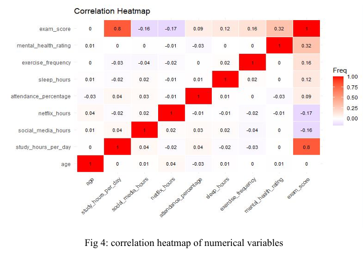

# 🎓 Student Performance Analysis

## 📌 Overview
This project analyzes student habits and academic performance using data science techniques. The goal is to understand how factors like study time, sleep, and social media usage affect academic outcomes.

---

## 🔍 Key Work
- Data cleaning and preprocessing  
- Exploratory Data Analysis (EDA)  
- Visualization of trends and patterns  
- Insight generation  

---

## 📊 Dataset
The dataset includes:
- Study hours  
- Social media usage  
- Sleep hours  
- Attendance  
- Academic performance  

---

## 📈 Key Insights
- Study hours positively impact performance  
- Excessive social media reduces performance  
- Proper sleep improves results  

---
## 📸 Output

### 🔥 Correlation Heatmap

---
## 🛠 Tech Stack
- R Programming  
- ggplot2  
- Data Analysis  

---

## ▶️ How to Run
1. Open `analysis.R` in RStudio  
2. Make sure `data.csv` is in the same folder  
3. Run the script  

---

## 📎 Project Files
- `analysis.R` → main code  
- `data.csv` → dataset  
- `student-performance-analysis-report.pdf` → full report  

---

## 👨‍💻 Author
**Avoy Mollick**  
AI Engineer | Data Science | NLP | Computer Vision
